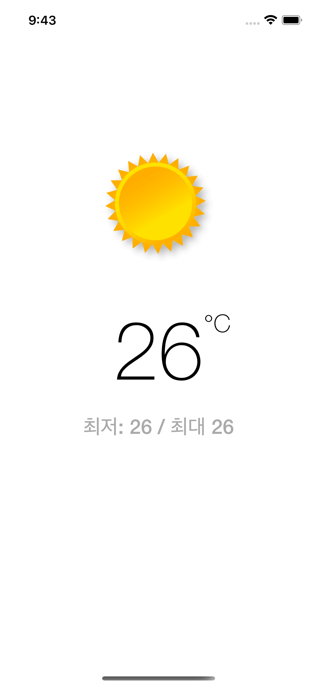
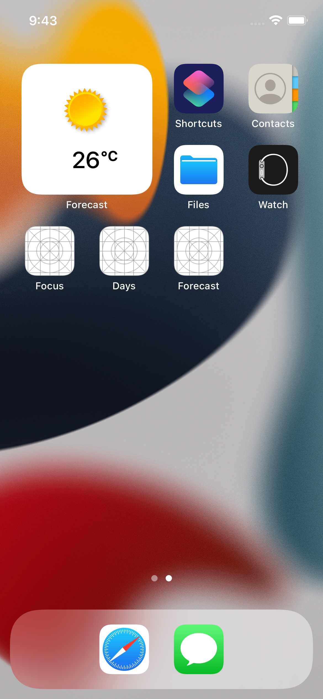

## 🧑‍🎓 Forecast
네트워크 통신을 이용하여 날씨정보를 보여주는 앱.

## 내용
- 공공 데이터 OPEN API 사용해보기
- 테스트케이스를 이용하여 모델링 작업해보기
- 네트워크모듈 작성해보기
- 당겨서 새로고침 적용해보기
- 홈 스크린 위젯 적용해보기

## 최종화면
 

## 더 고민해봐야 할 사항
- 다른 OPEN API 를 적용해보려면 어떻게 해야 할까?
- 위치 정보를 이용하여 현재 지역의 날씨를 가져오려면 어떻게 해야 할까?
- 날싸 정보를 이용한 새로운 아이디어 앱은 어떤것이 있을까?

### 링크
[첫화면으로 돌아가기](https://github.com/iwill-hwang/fastcampus-ios)
